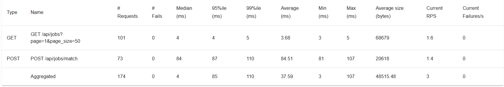
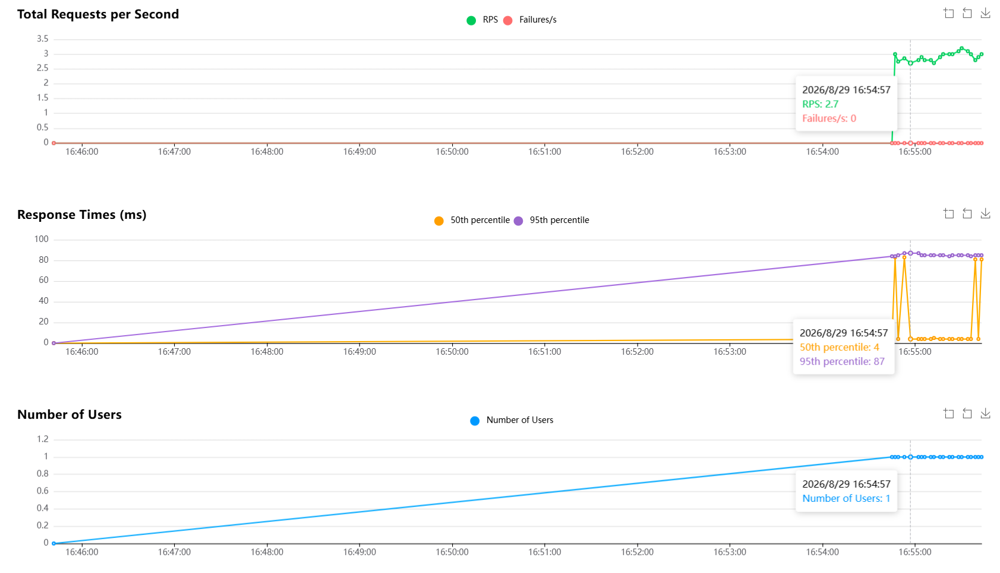
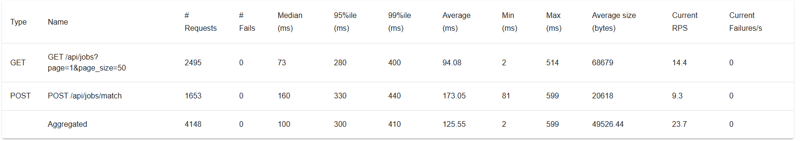
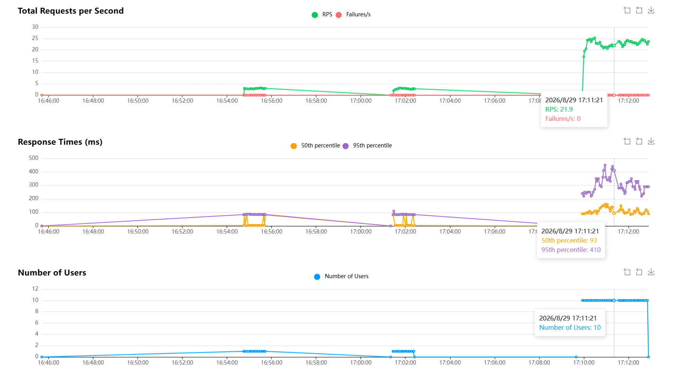

# FindJobs-Agent 压力测试计划（简历最小可行方案）

> 目标：用 **1 周内可完成** 的压测，产出能写进简历的对比数字（QPS / P95 / 错误率），而不是把全站每个接口都测一遍。
>
> 原则：**只压「服务侧可控、可复现、不烧 LLM 钱」的路径**；LLM 上游用 Mock 隔离。

---

## 1）任务清单（按顺序做）

- [x] **T1** 搭环境：安装 Locust、准备一份固定测试简历 ID、确认 `jobs_enriched.csv` 已加载、记录「优化前」启动方式（当前 `python app.py` / Flask 开发服）
- [ ] **T2** 写 Mock LLM 上游（固定 ~800ms 延迟 + 预设 JSON），用环境变量把 `LLM_API_URL` 指过去（本方案默认 **不压真实 LLM 接口**，节省成本且结果可复现）
- [x] **T3** 建立 Baseline：用 Locust 压测 **重点 A：`GET /api/jobs`** + **重点 B：`POST /api/jobs/match`**，记录 QPS、P50/P95、错误率，截图/表格存档
- [x] **T4** 做最小优化（建议只做这 3 件）：`/api/jobs` 进程内缓存（按文件 mtime 失效）、匹配结果短缓存、共享 `jobs_store` 读写加锁；可选：gunicorn `gthread` 替换 `app.run`
- [ ] **T5** 同场景复测：相同 Locust 参数再跑一遍，填「优化前 → 优化后」对比表
- [ ] **T6**（可选加分）面试链路伪依赖消除：`evaluate_answer` 与 `generate_technical_question` 并发；用 Mock LLM 测单轮延迟下降幅度
- [ ] **T7** 整理简历素材：1 张对比表 + 2～3 句「约束 → 方案 → 数字」结论；把 Locust 命令、参数、原始报告放进 `test/results/`

---

## 2）为什么只压这两个接口？（范围说明）

| 接口 | 是否压测 | 原因 |
|------|----------|------|
| `GET /api/jobs` | **必须** | 每次读 CSV + `iterrows` 全量返回，最易出「数量级」提升，数字最好看 |
| `POST /api/jobs/match` | **必须** | 纯 CPU、无 LLM，可复现；体现算法/缓存优化 |
| `POST /api/resume/upload` | **不做真实压测** | 依赖 LLM，贵且不稳定；若要测调度，走 T2 Mock |
| `POST /api/interview/*` | **仅 T6 可选** | 完整面试约 13 次 LLM；用 Mock 测「单轮延迟」即可，不要用真实 Key 打满 |
| 爬虫 / job_agent 批处理 | **不做** | 离线流水线，不是在线服务并发故事 |

简历只需要讲清楚：**在线匹配链路的吞吐与延迟**，以及（可选）**面试单轮伪依赖并行**。

---

## 3）手把手操作指南（零基础）

### 3.0 压测是什么？你要得到什么数字？

压测 = 用工具模拟很多人同时访问你的 API，观察服务是否变慢、报错。

你最终要填进表格的指标：

| 指标 | 含义 | 简历怎么写 |
|------|------|------------|
| **QPS / RPS** | 每秒成功处理的请求数 | 「吞吐从 X 提升到 Y」 |
| **P95 延迟** | 95% 的请求在多少毫秒内完成 | 「P95 从 Ams 降到 Bms」 |
| **错误率** | 失败请求占比（5xx、超时、连接失败） | 「错误率从 Z% 降至 0」 |
| **并发用户数** | Locust 里的 users 数量 | 写清测试条件，避免被质疑「虚报」 |

> 面试官常问：「你压的是什么？条件是什么？」——所以 **T3/T5 必须用同一组 users / spawn-rate / 时长**。

---

### 3.1 T1：准备环境（约 30 分钟）

#### Step 1：进入项目根目录

```powershell
cd E:\LLM\project\FindJobs-Agent
```

#### Step 2：安装 Locust（建议写进临时依赖，不必立刻改 requirements）

```powershell
pip install locust
```

验证：

```powershell
locust --version
```

#### Step 3：启动被测服务（优化前）

另开一个终端：

```powershell
cd E:\LLM\project\FindJobs-Agent
python api_server.py
```

浏览器或 curl 确认健康：

```powershell
curl http://127.0.0.1:5000/api/health
```

应返回 `{"status":"ok",...}`。

#### Step 4：准备 match 用的 `resume_id`

压测 match 需要一个已存在的简历 ID。任选其一：

**方式 A（推荐）**：前端或 Postman 上传一份 PDF，从返回 JSON 里复制 `resume.id`。

**方式 B**：若 `uploads/resumes_store.json` 里已有数据，打开文件，复制任意一个顶层 key（就是 resume_id）。

把这个 ID 记下来，后面 Locust 脚本会用到。例如：`a1b2c3d4-....`

#### Step 5：确保岗位数据存在

确认项目根目录有 `jobs_enriched.csv`（或至少有 `all_companies_jobs.json`）。  
先手动点一次接口，确认有数据：

```powershell
curl http://127.0.0.1:5000/api/jobs
```

看返回里的 `total` 是否 > 0。记下这个数量（1500），写进结果备注。

#### Step 6：建结果目录

```powershell
mkdir test\results
```

---

### 3.2 T2：Mock LLM（约 40 分钟，可选但强烈建议）

本 MVP **主压测不依赖 LLM**。只有当你想测简历上传 / 面试延迟时才需要 Mock。

#### 为什么要 Mock？

- 压真实 DeepSeek/OpenAI：**烧钱、被限流、延迟抖动大** → 测的是厂商，不是你的服务。
- Mock：固定 sleep + 固定 JSON → **测的是你的线程调度、超时、队列、并发安全**。

#### 最小 Mock 服务（新建 `tests/mock/mock_llm_server.py`）

自己写一个极简 Flask（可复制下面逻辑）：

```python
# test/mock_llm_server.py
import time
from flask import Flask, request, jsonify

app = Flask(__name__)

@app.post("/v1/chat/completions")
def chat():
    time.sleep(0.8)  # 模拟上游 RTT
    body = request.get_json(force=True) or {}
    # 返回 OpenAI 兼容结构；内容可按需改成合法 JSON 字符串
    content = '{"skills": [], "ok": true}'
    return jsonify({
        "choices": [{"message": {"content": content}}],
        "usage": {"prompt_tokens": 10, "completion_tokens": 5, "total_tokens": 15},
    })

if __name__ == "__main__":
    app.run(host="127.0.0.1", port=18080)
```

启动 Mock：

```powershell
python tests\mock\mock_llm_server.py
```

启动 API 时指向 Mock（PowerShell）：

```powershell
$env:LLM_API_URL="http://127.0.0.1:18080/v1/chat/completions"
python api_server.py
```

> 注意：`job_agent.OpenAIClient` 硬编码了 URL，**批处理 Harness 不会吃这个环境变量**；在线路径走 `llm_client.LLMClient` 才会生效。本 MVP 主压测不依赖这一点。

---

### 3.3 T3：写 Locust 脚本并跑 Baseline（约 1～2 小时）

#### Step 1：创建脚本 `test/locustfile.py`

```python
# test/locustfile.py
import os
from locust import HttpUser, task, between

RESUME_ID = os.environ.get("STRESS_RESUME_ID", "REPLACE_WITH_REAL_RESUME_ID")

class ApiUser(HttpUser):
    # 每个虚拟用户两次请求之间的思考时间（秒）
    wait_time = between(0.1, 0.5)

    @task(3)  # 权重 3：更频繁打 jobs 列表
    def list_jobs(self):
        with self.client.get("/api/jobs", name="GET /api/jobs", catch_response=True) as resp:
            if resp.status_code != 200:
                resp.failure(f"status={resp.status_code}")
            else:
                resp.success()

    @task(2)  # 权重 2：打匹配
    def match_jobs(self):
        with self.client.post(
            "/api/jobs/match",
            json={"resume_id": RESUME_ID},
            name="POST /api/jobs/match",
            catch_response=True,
        ) as resp:
            if resp.status_code != 200:
                resp.failure(f"status={resp.status_code} body={resp.text[:200]}")
            else:
                resp.success()
```

把 `REPLACE_WITH_REAL_RESUME_ID` 换成真实 ID，或用环境变量：

```powershell
$env:STRESS_RESUME_ID="你的resume_id"
```

#### Step 2：启动 Locust Web UI

在项目根目录：

```powershell
locust -f test\locustfile.py --host http://127.0.0.1:5000
```

浏览器打开：http://localhost:8089

#### Step 3：第一次建议参数（Baseline，务必记下来）

| 参数 | 建议值 | 说明 |
|------|--------|------|
| Number of users | **50** | 虚拟并发用户 |
| Spawn rate | **5** | 每秒增加 5 个用户 |
| Run time | **3m**（或手动停） | 至少跑满 2～3 分钟再看稳态 |

点 Start。等曲线平稳后看页面上的：

- Total Requests / Failures
- 各接口的 Median、**95%**、RPS

#### Step 4：无头模式（方便存档，推荐）

跑完 Web UI 熟悉后，用命令行导出 CSV：

```powershell
$env:STRESS_RESUME_ID="你的resume_id"
locust -f test\locustfile.py --host http://127.0.0.1:5000 `
  --users 50 --spawn-rate 5 --run-time 3m --headless `
  --csv test\results\baseline
```

会生成：

- `test/results/baseline_stats.csv`
- `test/results/baseline_failures.csv`
- …

#### Step 5：填写 Baseline 表（手抄或 Excel）

| 场景 | Users | Ramp up | 接口 | RPS | P95 (ms) | 错误率 |
|------|-------|------|-----|----------|--------|--------|
| 优化前 | 1 | 1 | GET /api/jobs | 0 | 13000 | 0 |
| 优化前 | 1 | 1 | POST /api/jobs/match | 0 | 180 | 0 |


> 若错误率突然飙高：先把 users 降到 20 重跑；也可能是 Flask 开发服扛不住——这本身就可以写成「优化动机」。

优化：

| 接口                   | 现在                 | 期望（务实）                     |
| :--------------------- | :------------------- | :------------------------------- |
| `GET /api/jobs`        | ~13s / 4.5MB / RPS≈0 | P95 <500ms，体积明显下降或可分页 |
| `POST /api/jobs/match` | ~130ms 但回包 ~5.2MB | 延迟保持或更好，回包只返回 Top-N |

| 场景   | Users | Ramp up | 接口                               | RPS  | P95 (ms) | 错误率 |
| ------ | ----- | ------- | ---------------------------------- | ---- | -------- | ------ |
| 优化后 | 1     | 1       | GET /api/jobs?page=18&page_size=50 | 1.6  | 4        | 0%     |
| 优化后 | 1     | 1       | POST /api/jobs/match (top_k=20)    | 1.4  | 87       | 0%     |
| 优化后 | 10    | 5       | GET /api/jobs?page=18&page_size=50 | 14.4 | 280ms    | 0%     |
| 优化后 | 10    | 5       | POST /api/jobs/match (top_k=20)    | 9.3  | 330ms    | 0%     |

Figure 1.1 优化前 user=1



Figure 1.2 优化前 user=1



Figure 2.1 优化后 user=10



Figure 2.2 优化后 user=10




---

### 3.4 T4：做「简历够用」的最小优化（约 1～2 天）

按优先级只做这些（做完就能复测）：

1. **`GET /api/jobs` 内存缓存**  
   - 用模块级变量缓存已解析的 `jobs` 列表  
   - 用 `jobs_enriched.csv` 的 `mtime`（或文件大小+mtime）判断是否失效  
   - 避免每次请求 `pd.read_csv` + `iterrows`

2. **`jobs_store` 并发安全**  
   - 用 `threading.RLock` 包住 `clear/extend` 与 match 读路径  
   - 避免压测时偶发空列表 / 半截数据

3. **匹配短缓存（可选但很加分）**  
   - key：`(resume_id, jobs_version)`，jobs_version 可用文件 mtime  
   - TTL 或仅内存、进程内即可

4. **（可选）gunicorn 启动**  

```powershell
pip install gunicorn   # 已在 requirements 中
# Windows 上 gunicorn 支持较差；若在 Windows 本地，可跳过本步，或用 WSL/Docker 复测「生产启动」
gunicorn -w 1 -k gthread --threads 8 -b 0.0.0.0:5000 api_server:app
```

> Windows 原生跑 gunicorn 常有问题。简历写法可以是：「本地用 Locust 对 Flask 开发服建基线；生产镜像用 gunicorn gthread 复测」。Docker 里复测更干净。

---

### 3.5 T5：复测并做对比表（约 30 分钟）

**必须使用与 T3 完全相同的 users / spawn-rate / run-time。**

```powershell
$env:STRESS_RESUME_ID="你的resume_id"
locust -f test\locustfile.py --host http://127.0.0.1:5000 `
  --users 50 --spawn-rate 5 --run-time 3m --headless `
  --csv test\results\after
```

对比表模板：

| 接口 | 指标 | 优化前 | 优化后 | 提升 |
|------|------|--------|--------|------|
| GET /api/jobs | RPS |  |  |  |
| GET /api/jobs | P95 |  |  |  |
| POST /api/jobs/match | RPS |  |  |  |
| POST /api/jobs/match | P95 |  |  |  |
| 整体 | 错误率 |  |  |  |

把 `baseline_stats.csv` 与 `after_stats.csv` 一起提交/留存，面试可当场打开。

---

### 3.6 T6（可选）：面试单轮伪依赖并行

代码位置：`interview_agent.py` 的 `respond()` 在 `qa` 阶段先 `evaluate_answer` 再 `generate_technical_question`，后者**不依赖**评分结果。

做法简述：

1. 用 `concurrent.futures.ThreadPoolExecutor` 同时提交「评分」和「出下一题」
2. 启动 Mock LLM（固定 800ms）
3. 用一个小脚本对 `POST /api/interview/<id>/message` 连续打 20 次，统计平均耗时

验收标准：单轮端到端延迟大约从「~1.6s + 业务开销」降到「~0.8s + 业务开销」（Mock 下约减半）。

---

### 3.7 T7：简历怎么写（直接套数字）

把实测数字填进去，句式示例：

> 针对校招岗位列表与人岗匹配接口建立 Locust 压测基线（50 并发 / 3min）；通过岗位数据按文件 mtime 失效的进程内缓存与匹配结果缓存，将 `GET /api/jobs` RPS 从 **A** 提升至 **B**、P95 从 **Cms** 降至 **Dms**，压测错误率从 **E%** 降至 **0**。匹配层保持无 LLM，保证低成本与结果可解释。

可选第二句（若做了 T6）：

> 面试状态机中识别评分与出题的伪依赖，改为并行调用（Mock 上游验证），单轮响应延迟降低约 **X%**。

---

## 4）常见坑（第一次压测几乎都会遇到）

| 现象 | 可能原因 | 怎么办 |
|------|----------|--------|
| match 全是 404 | `STRESS_RESUME_ID` 错了或服务重启丢了内存会话；简历虽有落盘，确认已 `_load_resumes_from_disk` | 重启后先 `GET /api/resume/<id>` 验证 |
| jobs 的 RPS 极低、CPU 打满 | 每次读 CSV + pandas 遍历 | 正是 T4 缓存要解决的 |
| 一加压就大量失败 | Flask 单进程开发服；或超时 | 先降到 20 users；再考虑 gunicorn/Docker |
| Locust 自己很卡 | 本机 CPU 不够 / users 太大 | users 50 足够写简历；不要盲目上 1000 |
| 想压 upload 结果乱跳 | 打到了真实 LLM | 必须走 Mock + `LLM_API_URL` |

---

## 5）本方案明确不做的事（避免范围膨胀）

- 不上 Locust 压真实付费 LLM
- 不写全站每个 API 的场景
- 不上 K6/JMeter（多工具不增加简历说服力）
- 不把爬虫吞吐量当成「高并发」主叙事
- 不要求一开始就上 Prometheus 全集群（有对比表即可；有余力再加 `/api/metrics`）

---

## 6）建议时间表

| 天 | 任务 |
|----|------|
| Day 1 | T1 + T3 Baseline（先有数字） |
| Day 2～3 | T4 缓存 + 锁（必要时 Docker/gunicorn） |
| Day 4 | T5 复测 + 填对比表 |
| Day 5 | T6 可选 + T7 简历措辞 |

**记住顺序：先 Baseline，再优化，再复测。** 没有「优化前」数字的优化，简历上站不住。
)
